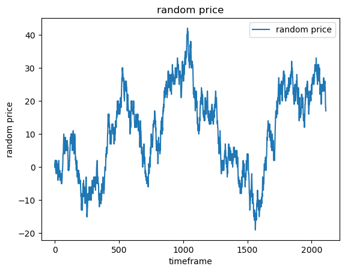
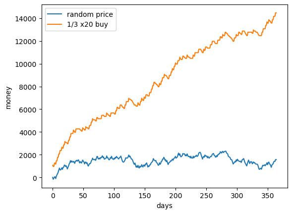
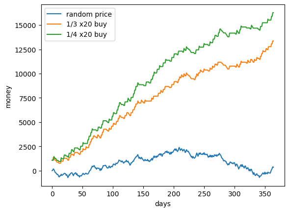
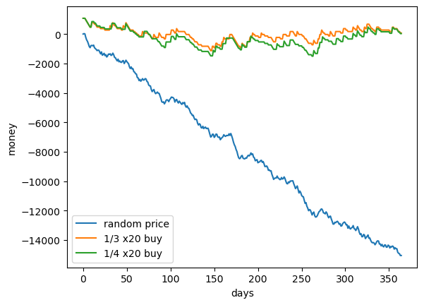
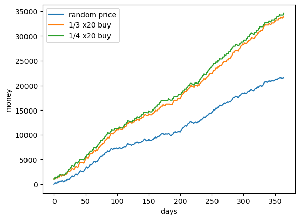

# Study on Risk and Randomness

A comprehensive examination of the interplay between risk and randomness in various domains. This study aims to explore the nature of uncertainty, the influence of random events on outcomes, and the strategies for managing risk in different contexts. Through research and analysis, this study investigates the fundamental principles underlying risk and randomness, their impact on decision-making processes, and the implications for individuals. By shedding light on these crucial aspects, the study provides valuable insights into understanding, assessing, and navigating uncertainties, enabling informed decision-making and risk mitigation strategies.

## Our scenario

Lets imagine we have a world where prices are completely random in a market, and that these prices flauctuate between -200 and 200 per timeframe, or between x1 and x2 per timeframe. 

Things to Notice in this scenario:

-There is no trading psicology, and this means that, past prices do not influence in any way future prices.

-There are no external events that influence prices.

-There is no market mechanics like short covering that influence prices.

-From one timeframe to another, prices move randomly between x1 and x2 ( in this case between -200 and 200).

## Our Agent

Our agent can only choose its stoploss, and take profit for the position.

Things to Notice in our agent:

- Agents actions do not have an influence in the price for that day or following days.

- the agent can only buy, and that means that if the price goes up, he earns money when it hits the take profit.

- the agent can only buy, and that means that if the price goes down, he looses money when it hits the stoploss.  

## 1 to 3 risk reward ratio

1 to 3 risk to reward ratio

## 1 to 3 risk reward ratio and 1 to 4 risk reward ratio 

1 to 3 risk reward ratio and 1 to 4 risk reward ratio 

## things to notice

1. does a 1 to 20 risk to reward ration became counter productive?

2. the price moves in a constant way always nearing a center with a slope of 0.

## if the market has a downwards pressure on price

if the market has a downwards pressure on price

the price moves in a constant way always nearing a linear equation with a negative slope.

## if the market has a upwards pressure on price (the same vector of direction of the position)

if the market has a upwards pressure on price

the price moves in a constant way always nearing a linear equation with a negative slope.

## conclusion on price direction and risk to one position bias

if you are in the direction of the market with a 1 to x risk, your profits go up.

if you are not in the direction of the market with a 1 to x risk your profits go negative.

if the market is just random with no direction, a 1 to x risk will give you sure profits in the long run,
and this can be measured mathematicly.